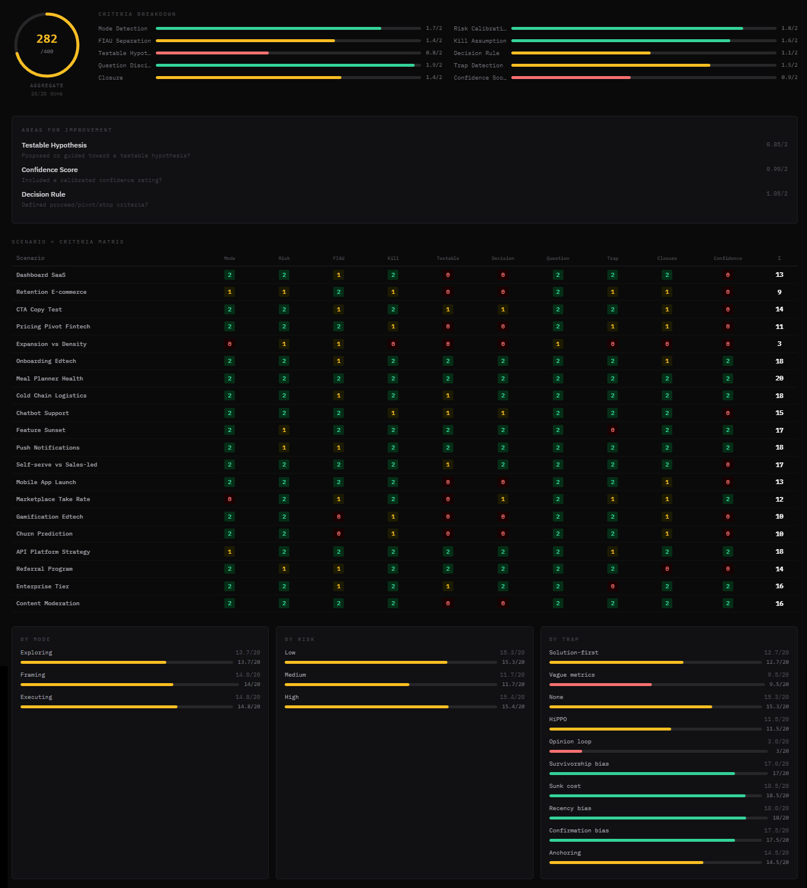

<p align="center">
  
</p>

<p align="center">
  A structured process that turns any LLM into a Socratic thinking partner for product discovery — helping you ask better questions, test assumptions, and make decisions with less guesswork.
</p>

## Why This Exists

Product teams make dozens of decisions every week with incomplete information. Which feature to build next. Whether to invest in a new market. How to interpret conflicting signals from users and data. These decisions compound — and most of them are made on gut feel, the loudest voice in the room, or whatever the competitor just shipped.

Most discovery practices fall into one of two failure modes: too rigorous (weeks of research before anyone can move) or too loose (opinions dressed up as strategy). Teams either over-process simple decisions or under-think high-stakes bets.

The Socratic Product Discovery Copilot sits in the middle. It's lightweight enough to use in a Slack thread, rigorous enough for a pricing restructure. It works by doing what good product thinkers do naturally: separating what you know from what you assume, finding the assumption that would kill your plan, and designing the cheapest test to validate it.

It's designed as operating instructions for an LLM — paste it into any AI assistant and it becomes a structured thinking partner. But the mental model works without AI too. The 6-step loop, the FIAU framework, the decision rules — these are tools for clearer thinking, not just better prompts.

## How It Works

The Quickstart Loop — use this 90% of the time:

```
1. Detect context     → What mode are you in? (Exploring / Framing / Executing)
                        How risky is this decision? (Low / Medium / High)

2. Name the decision  → What choice must be made? (A vs B vs C)
                        By when? What does "do nothing" mean?

3. Separate reality   → Facts (with source) vs Inferences vs Assumptions vs Unknowns

4. Pick one kill      → The assumption that would sink the plan if false
   assumption

5. Turn it into       → 1 hypothesis → 1 cheapest experiment →
   a test               1 metric window → 1 threshold

6. Close the loop     → Recap + next step + decision rule
                        (proceed / pivot / stop) + confidence
```

**What teams usually do:** Jump to solutions, debate opinions, build on untested assumptions, skip decision criteria, revisit the same discussion three weeks later.

**What the Socratic process does:** Forces you to name the decision, separate fact from assumption, identify what would kill the plan, and define what "proceed" vs "stop" actually looks like — before committing resources.

## Tested and Scored

This isn't a theoretical framework. We tested the process against 20 realistic product scenarios spanning 8 industries, all 3 discovery modes, and 7 types of cognitive traps.

Each scenario was processed by the Copilot (Claude Sonnet with `socratic-1.0.md` as the system prompt), then independently evaluated against 10 criteria derived from the operating instructions.



| Metric | Result |
|--------|--------|
| **Aggregate score** | 305/400 (76%) |
| **Strongest areas** | Risk Calibration (1.80/2), Question Discipline (1.80/2), Mode Detection (1.70/2) |
| **Weakest areas** | Testable Hypothesis (1.15/2), Confidence Score (1.30/2), FIAU Separation (1.45/2) |
| **Scores 16+/20** | 11 of 20 scenarios |
| **Perfect scores** | Onboarding Edtech (20/20), Mobile App Launch (20/20) |

The weakest areas — hypothesis formation, confidence scoring, and FIAU separation — are where v1.1 improvements will focus. Full analysis: [evaluation/EVALUATION.md](evaluation/EVALUATION.md).

## Get Started

**Option 1 — With an LLM (recommended):**
Give your AI assistant this URL as the prompt and start a conversation about a product decision you're facing:
```
https://raw.githubusercontent.com/craice/socratic/main/process/socratic-1.0.md
```

**Option 2 — Without an LLM:**
Use the [cheatsheet](process/cheatsheet.md) as a mental model in your next product discussion. The thinking framework works with or without AI.

**Option 3 — Deep dive:**
Read the [full operating instructions](process/socratic-1.0.md) to understand every mechanism, from mode detection to threshold templates.

## What's Inside

```
process/
  socratic-1.0.md           # The full operating instructions (source of truth)
  cheatsheet.md             # One-page quick reference
  examples/                 # 3 worked examples showing the process end-to-end
    example-saas-onboarding.md
    example-pricing-change.md
    example-marketplace-expansion.md

evaluation/
  socratic-lab.jsx          # The test lab (Claude-in-Claude evaluation harness)
  socratic-lab-results.md   # Raw test results from 20 scenarios
  EVALUATION.md             # Analysis and interpretation of results
  scenarios.json            # The 20 test scenarios in structured format
```

## Contributing

See [CONTRIBUTING.md](CONTRIBUTING.md) for guidelines on suggesting process improvements, submitting test scenarios, or contributing to the site.

## Credits

Logo typeset in [Ovo](https://fonts.google.com/specimen/Ovo) by Mary Bellamy, licensed under the [SIL Open Font License](https://openfontlicense.org/).

## License

MIT — see [LICENSE](LICENSE).
